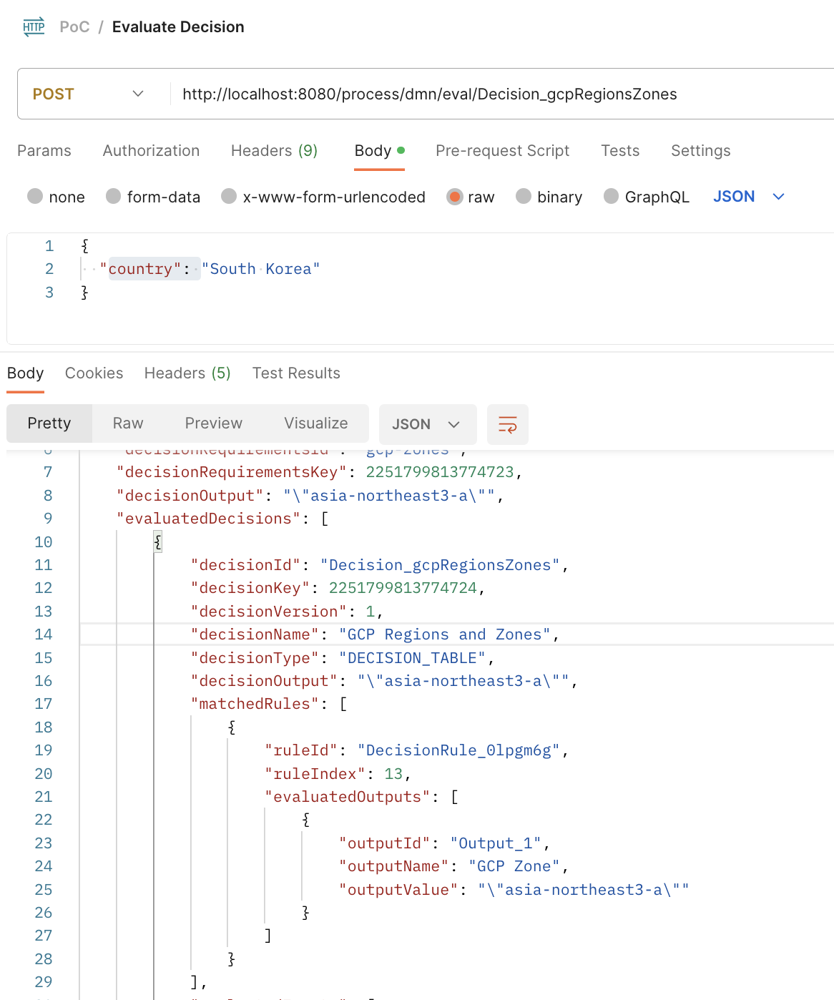
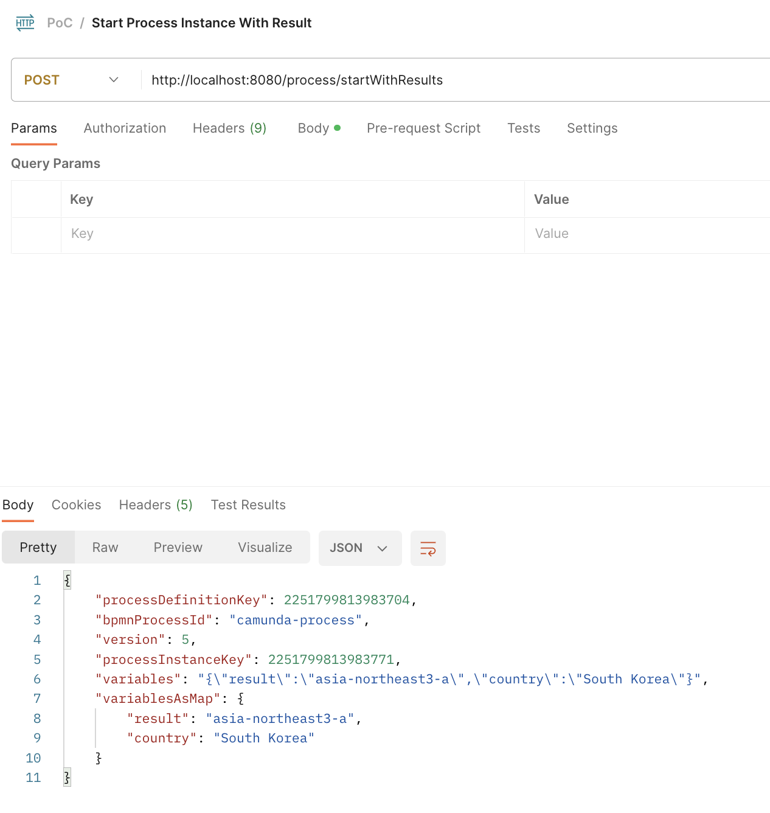

[](https://github.com/camunda-community-hub/community)

[](https://github.com/Camunda-Community-Hub/community/blob/main/extension-lifecycle.md#incubating-)

# Evaluation DMN example

This is example code that demonstrates a few concepts:

0. How to connect to SM
1. How to evaluate a DMN Table directly (without having to run the associated BPMN process)
2. How to run a BPM process end-to-end and get the result

### 0. Connecting to Self Managed

Here' a sample config for connecting a Zeebe Client to a Camunda 8 Self Managed environment.
```
# Set this to the url of the Zeebe Gateway. Most likely, the Gateway is exposed by an ingress over port 443
zeebe.client.broker.gatewayAddress=my.zeebe.gateway.com:443
# This should be set to fals for tls
zeebe.client.security.plaintext=false

# By default, the Zeebe Gateway will be secured via OAuth2 by Camunda Identity.
# You'll need to configure an Identity M2M Application as described here: https://docs.camunda.io/docs/self-managed/concepts/access-control/applications/.
zeebe.client.cloud.clientId=<YOUR_M2M_CLIENT_ID>
zeebe.client.cloud.clientSecret=<YOUR_M2M_CLIENT_SECRET>
```

### 1. Evaluate a DMN Decision directly

The [ProcessController.java](src/main/java/org/example/camunda/process/solution/facade/ProcessController.java) file implements a few methods that are exposed as a rest api.

The method named `EvaluateDecisionResponse` uses a [Zeebe Client](https://docs.camunda.io/docs/apis-tools/grpc/) that connects to a Camunda 8 Gateway and sends a request to evaluate a specific DMN Decision Id.

For convenience, the method is exposed as a rest API endpoint. To run, send a `POST` request to [https://localhost:8080/process/dmn/eval/{decisionId}](https://localhost:8080/process/dmn/eval/{decisionId}).

The [gcp-regions.dmn](src/main/resources/models/gcp-regions.dmn) file contains a [DMN DRD](https://docs.camunda.io/docs/components/modeler/dmn/decision-requirements-graph/). The DRD includes a Decision Table named `Decision_gcpRegionsZones`.

So, to call this decision, send a `POST` like so. You can pass `country` as input variable inside json request body.

```java
POST https://localhost:8080/process/dmn/eval/Decision_gcpRegionsZones
```

Here's a working example in PostMan:



### 2. Run BPMN Process with results

The method `startProcessInstanceWithResults` inside the [ProcessController](src/main/java/org/example/camunda/process/solution/facade/ProcessController.java) uses a [Zeebe Client](https://docs.camunda.io/docs/apis-tools/grpc/) that connects to a Camunda 8 Gateway and sends a request to start a process instance and then wait for the instances to complete before returning results.

For convenience, the method is exposed as a rest API endpoint. To run, send a `POST` request to [https://localhost:8080/process/startWithResults](https://localhost:8080/process/dmn/eval/startWithResults).

The [camunda-process.bpmn](src/main/resources/models/camunda-process.bpmn) file contains a defintion of a [BPMN Process](https://docs.camunda.io/docs/components/modeler/bpmn/bpmn-primer/) that calls a single Business Rule task, which in turn runs a DMN Decision.

You can use the `startWithResults` method to run a process instance and get the results of the Business Rule (and corresponding DMN Decision)

For example, send a `POST` like so. You can pass `country` as input variable inside json request body.

```java
POST https://localhost:8080/process/dmn/eval/startWithResults
```

Here's a working example in PostMan:



### Process Solution Template

This project was started based on the [camunda-8-process-solution-template project](https://github.com/camunda-community-hub/camunda-8-process-solution-template). The README file below describes more:

# Process Solution Template for Camunda Platform 8 using Java and Spring Boot


This repository contains a Java application template for Camunda Platform 8 using Spring Boot
and a [docker-compose.yaml](docker-compose.yaml) file for local development. For production setups we recommend to use our [helm charts](https://docs.camunda.io/docs/self-managed/platform-deployment/kubernetes-helm/).

- [Documentation](https://docs.camunda.io)
- [Camunda Platform SaaS](https://camunda.io)
- [Getting Started Guide](https://github.com/camunda/camunda-platform-get-started)
- [Releases](https://github.com/camunda/camunda-platform/releases)
- [Helm Charts](https://helm.camunda.io/)
- [Zeebe Workflow Engine](https://github.com/camunda/zeebe)
- [Contact](https://docs.camunda.io/contact/)

## Using this template

Fork [this repository](https://github.com/camunda-community-hub/camunda-process-solution-template) on GitHub
and rename/refactor the following artifacts:

* `groupId`, `artifactId`, `name`, and `description` in [pom.xml](pom.xml)
* `process/@id` and `process/@name` in [src/main/resources/models/camunda-process.bpmn](src/main/resources/models/camunda-process.bpmn)
* `ProcessConstansts#BPMN_PROCESS_ID` in [src/main/java/org/example/camunda/process/solution/ProcessConstants.java](src/main/java/org/example/camunda/process/solution/ProcessConstants.java)
* Java package name, e.g. `org.example.camunda.process.solution.*`

By forking this project, you can stay connected to improvements that we do to this template and simply pull updates into your fork, e.g. by using GitHub's Web UI or the following commands:

```sh
git remote add upstream git@github.com:camunda-community-hub/camunda-8-process-solution-template.git
git pull upstream main
git push
```

### Forking to GitLab
```
gh repo clone camunda-community-hub/camunda-8-process-solution-template new-project-folder
cd new-project-folder
git remote set-url origin git@gitlab.com:new-project/new-repo
```


## First steps with the application

The application requires a running Zeebe engine.
You can run Zeebe locally using the instructions below for Docker Compose
or have a look at our
[recommended deployment options for Camunda Platform](https://docs.camunda.io/docs/self-managed/platform-deployment/#deployment-recommendation.).

Run the application via
```
./mvnw spring-boot:run
```

Swagger UI: [http://localhost:8080/swagger-ui.html](http://localhost:8080/swagger-ui.html)

## Using docker-compose

> :information_source: The docker-compose file in this repository uses the latest [compose specification](https://docs.docker.com/compose/compose-file/), which was introduced with docker-compose version 1.27.0+. Please make sure to use an up-to-date docker-compose version.

> :information_source: The Docker required is 20.10.16+

To stand-up a complete Camunda Platform 8 Self-Managed environment locally the [docker-compose.yaml](docker-compose.yaml) file in this repository can be used.

The full enviornment contains these components:
- Zeebe
- Operate
- Tasklist
- Connectors
- Optimize
- Identity
- Elasticsearch
- Keycloak

Clone this repo and issue the following command to start your environment:

```
docker-compose up -d
```

Wait a few minutes for the environment to start up and settle down. Monitor the logs, especially the Keycloak container log, to ensure the components have started.

Now you can navigate to the different web apps and log in with the user `demo` and password `demo`:
- Operate: [http://localhost:8081](http://localhost:8081)
- Tasklist: [http://localhost:8082](http://localhost:8082)
- Optimize: [http://localhost:8083](http://localhost:8083)
- Identity: [http://localhost:8084](http://localhost:8084)
- Elasticsearch: [http://localhost:9200](http://localhost:9200)

Keycloak is used to manage users. Here you can log in with the user `admin` and password `admin`
- Keycloak: [http://localhost:18080/auth/](http://localhost:18080/auth/)

The workflow engine Zeebe is available using gRPC at `localhost:26500`.

To tear down the whole environment run the following command

```
docker-compose down -v
```

If Optimize, Identity, and Keycloak are not needed you can use the [docker-compose-core.yaml](docker-compose-core.yaml) instead which does not include these components:

```
docker-compose -f docker-compose-core.yaml up -d
```

Zeebe, Operate, Tasklist, along with Optimize require a separate network from Identity as you'll see in the docker-compose file.

In addition to the local environment setup with docker-compose, you can download the [Camunda Desktop Modeler](https://camunda.com/download/modeler/) to locally model BPMN diagrams for execution and directly deploy them to your local environment.

Feedback and updates are welcome!

## Connectors

Both docker-compose files contain our [out-of-the-box Connectors](https://docs.camunda.io/docs/components/integration-framework/connectors/out-of-the-box-connectors/available-connectors-overview/).

Refer to the [Connector installation guide](https://docs.camunda.io/docs/self-managed/connectors-deployment/install-and-start/) for details on how to provide the related Connector templates for modeling.

To inject secrets into the Connector runtime they can be added to the
[`connector-secrets.txt`](connector-secrets.txt) file inside the repository in the format `NAME=VALUE`
per line. The secrets will then be available in the Connector runtime with the
format `secrets.NAME`.

To add custom Connectors either create a new docker image bundling them as
described [here](https://github.com/camunda/connectors-bundle/tree/main/runtime).

Alternatively, you can mount new Connector JARs as volumes into the `/opt/app` folder by adding this to the docker-compose file. Keep in mind that the Connector JARs need to bring along all necessary dependencies inside the JAR.

## Kibana

A `kibana` profile is available in the provided docker compose files to support inspection and exploration of the Camunda Platform 8 data in Elasticsearch.
It can be enabled by adding `--profile kibana` to your docker compose command.
In addition to the other components, this profile spins up [Kibana](https://www.elastic.co/kibana/).
Kibana can be used to explore the records exported by Zeebe into Elasticsearch, or to discover the data in Elasticsearch used by the other components (e.g. Operate).

You can navigate to the Kibana web app and start exploring the data without login credentials:

- Kibana: [http://localhost:5601](http://localhost:5601)

> **Note**
> You need to configure the index patterns in Kibana before you can explore the data.
> - Go to `Management > Stack Management > Kibana > Index Patterns`.
> - Create a new index pattern. For example, `zeebe-record-*` matches the exported records.
>   - If you don't see any indexes then make sure to export some data first (e.g. deploy a process). The indexes of the records are created when the first record of this type is exported.
> - Go to `Analytics > Discover` and select the index pattern.

## Web Modeler Self-Managed Beta Release

> :warning: Web Modeler Self-Managed is currently offered as a [beta release](https://docs.camunda.io/docs/next/reference/early-access#beta) with limited availability for enterprise customers only. It is not recommended for production use, and there is no maintenance service guaranteed. Special [terms & conditions](https://camunda.com/legal/terms/camunda-platform/camunda-platform-8-self-managed/) apply. However, we encourage you to provide feedback via your designated support channel or the [Camunda Forum](https://forum.camunda.io/).

The Docker images for Web Modeler Beta are available in a private registry. Enterprise customers either already have credentials to this registry, or they can request access to this registry through their CSM contact at Camunda.

To run Camunda Platform with Web Modeler Self-Managed clone this repo and issue the following commands:

```
$ docker login registry.camunda.cloud
Username: your_username
Password: ******
Login Succeeded
$ docker-compose -f docker-compose.yaml -f docker-compose-web-modeler-beta.yaml up -d
```

To tear down the whole environment run the following command

```
$ docker-compose -f docker-compose.yaml -f docker-compose-web-modeler-beta.yaml down -v
```

If you want to delete everything (including any data you created).
Alternatively, if you want to keep the data run:

```
$ docker-compose -f docker-compose.yaml -f docker-compose-web-modeler-beta.yaml down
```

### Web Modeler
Now you can access Web Modeler Self-Managed and log in with the user `demo` and password `demo` at [http://localhost:8070](http://localhost:8070).

Once you are ready to deploy or execute processes use these settings to deploy to the local Zeebe instance:
* Authentication: None
* URL: `zeebe:26500`

### Emails
The setup includes [MailHog](https://github.com/mailhog/MailHog) as a test SMTP server. It captures all emails sent by Web Modeler, but does not forward them to the actual recipients.

You can access emails in MailHog's Web UI at [http://localhost:8075](http://localhost:8075).

# Camunda Platform 7

- [Documentation](https://docs.camunda.org/)
- [GitHub](https://github.com/camunda/camunda-bpm-platform)

# Troubleshooting
## Running on arm64 based hardware
When using arm64-based hardware like a M1 or M2 Mac the Keycloak container might not start because Bitnami only
provides amd64-based images. Until bitnami adds
[support for linux/arm64 images](https://github.com/bitnami/charts/issues/7305), you can build and tag an arm-based
image locally using the following command. After building and tagging the image you can start the environment as
described in [Using docker-compose](#using-docker-compose).

```
$ DOCKER_BUILDKIT=0 docker build -t bitnami/keycloak:19.0.3 "https://github.com/camunda/camunda-platform.git#main:.keycloak/"
```
